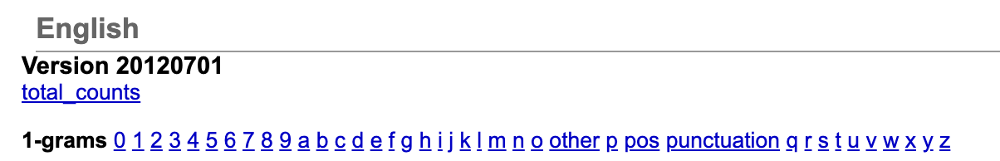

# Raw Data Folder

This folder contains the raw data used in the analysis. The data is not included in the repository as it is too large, but can be found at the following links:

- [Open American National Corpus](https://anc.org/data/oanc/)
  - We used the entire collection of the OANC, which is ~7.4GB
- [Google Ngram Viewer](http://storage.googleapis.com/books/ngrams/books/datasetsv2.html)
  - We are using the 2012 1-gram English all dataset which is ~26.2GB

## Downloading the data
- OANC: [Click here](https://anc.org/data/oanc/download/) or go to the link above and click on the download button.
- Google Ngram: go to the link above, and click on the links under English Version 20120701 1-grams to downaload the files we used.
  - 
  - Or, open the developer tools and copy and paste the following script into the console:
```js
let anchors = document.querySelectorAll("a")
let oneGrams = []

anchors.forEach(anchor => {
    if(anchor.href.includes("eng-all-1gram")) oneGrams.push(anchor)
}); 
oneGrams.splice(-10)

let i = 0
for(let gram of oneGrams) { 
    setTimeout(() => { 
        gram.click() 
    }, i * 10000); 
    i = i + 1; 
}
```