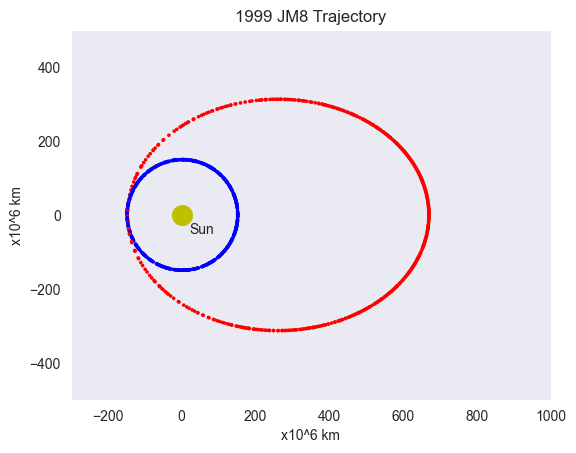
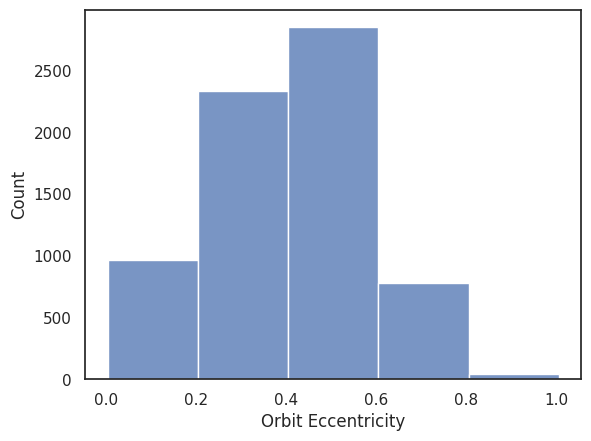
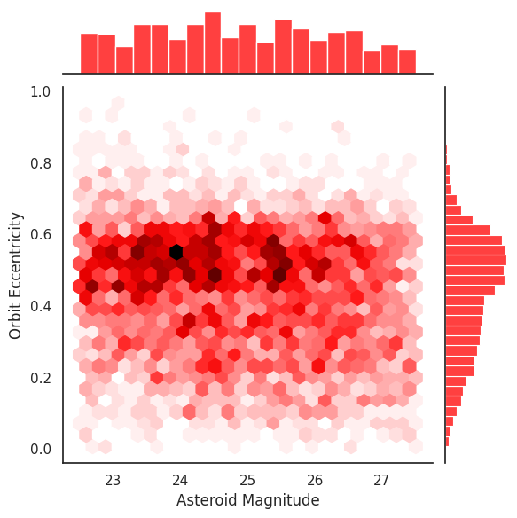

# Group 34 - Final Report

## Introduction
Our project aims to use data on Near Earth Asteroids to identify their positions and the threats they might pose to us. We chose this project because both of us are interested in space, and wanted to do a project on something in our solar system. 

We obtained our data from NASA's [Centre of Near Earth Object Studies (CENOS)](https://cneos.jpl.nasa.gov/ca/) and their [Kaggle Page](https://www.kaggle.com/datasets/nasa/asteroid-impacts). 

## Exploratory Data Analysis
Our initial Exploratory Data Analysis did not yield significant results. We were unable to interesting relationships between the data. 

This is where we decided to split our EDAs based on each analysis. Ankkit decided to focus on the orbits of the asteroids, while Ben decided to focus on the close approaches of the asteroids and the potential damage they could cause.

## Research Questions

### **Ben's Research Question:** Can we identify potentially hazardous asteroids (PHAs) based on their orbital parameters and physical characteristics, and how hazardous are they?

Ben wrote a function that calculates and plots the trajectory of an asteroid based on Kepler's laws of motion.

He assumed all asteroids would be the densest possible kind (M-Class, with a nickel-iron core), and then used the maximum approximated diameter of each asteroid, along with its velocity to calculate its Kinetic Energy in case of a hypothetical impact.

Ben concluded that most asteroids in the dataset do not pose much threat to the Earth. He identified three asteroids that could cause significant damage to the Earth. However destructive potential of these asteroids was found to be much smaller than current Thermonuclear Weapons that humanity wields today. The threat of these asteroids is further minimized by the fact that a lot of them may not be as massive as assumed, and that a lot of the Kinetic Energy of these asteroids is lost during entry into the Earth's atmosphere.

The analysis file can be found here: [Analysis](analysis/analysis1.ipynb)

### **Ankkit's Research Question:** What is the most common range of the orbit eccentricites, orbit inclinations, and orbit axes of asteroids that are hazardous to Earth? 

Ankkit tried to identify regions of asteroids near-Earth space that are most likely to contain PHAs. 

He found that most asteroids in the dataset had a magnitude between 22.5 and 27.5, an inclination between 0 and 10 degrees, and an eccentricity between 0.2 and 0.6.

However, these results did not reveal new information about the orbits of PHAs. For example, the most objects have an elliptical orbit, which makes the eccentricity's range of 0.2 to 0.6 not surprising. Similarly, the inclination's range of 0 to 10 degrees is not surprising, as the solar system is, for the most part, rather flat. This means that the inclination of asteroids being most common in this range is not surprising.

Ankkit's analysis was able to identify a lot of common ranges for asteroids, but these ranges were not surprising, and largely matched the common ranges that asteroids are searched for in.

The analysis file can be found here: [Analysis](analysis/analysis2.ipynb)

## Conclusion
Our project was able to identify a few asteroids that could cause significant damage to the earth, and was in line with our current understanding of objects in the solar system. 

We concluded that most Potentially Hazardous Asteroids aren't particularly hazardous.

Both Ben and Ankkit had prior experience in programming in python, but both learned how to use the seaborn library. 